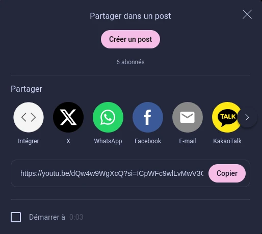
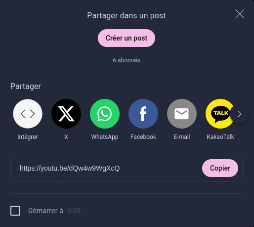

# Remove YouTube tracking

This very simple web extension aims to remove the tracking parameters from YouTube URLs. 
It does so by removing the `si` parameter of URL shared using the *Share* button on YouTube.

This should work on every YouTube subdomains, like `music.youtube.com`.

## Usage
Just install the extension, and it will remove the `si` parameter automatically.
You can also use the copy button, it will have the `si` parameter removed too.

*Please note that you may see the `si` parameter for a very short time before it is removed.*

Before :

---

After:

---
Licensed under the CC-BY-NC-ND 4.0 license.

